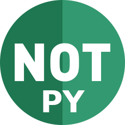

pronotepy's documentation
=========================

Introduction
^^^^^^^^^^^^

This is a Python API wrapper for the PRONOTE student administration service.
Pronotepy supports student, parent, and partially vie-scolaire accounts.

.. note:: This project does **not** use the HYPERPLANNING API provided by PRONOTE.

Dependencies
^^^^^^^^^^^^

* `cryptodome`_
* `beautifulsoup4`_
* `requests`_
* `autoslot`

.. _cryptodome: https://pypi.org/project/pycryptodome/
.. _beautifulsoup4: https://pypi.org/project/beautifulsoup4/
.. _requests: https://pypi.org/project/requests/
.. _autoslot: https://pypi.org/project/autoslot/

Guide
^^^^^

.. toctree::
   :maxdepth: 3

   quickstart

PronotePy API documentation
^^^^^^^^^^^^^^^^^^^^^^^^^^^

.. toctree::
   :maxdepth: 2

   api/index

Indices and tables
^^^^^^^^^^^^^^^^^^

* :ref:`genindex`
* :ref:`modindex`
* :ref:`search`
