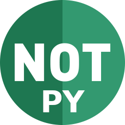

pronotepy's documentation
=========================

Introduction
^^^^^^^^^^^^

Pronotepy is an unofficial Python wrapper for the PRONOTE (school
administration service) private API.

It currently supports student accounts.

Guide
^^^^^

.. toctree::
   :maxdepth: 3

   quickstart
   logging-in

Pronotepy API documentation
^^^^^^^^^^^^^^^^^^^^^^^^^^^

.. toctree::
   :maxdepth: 2

   api/index

Indices and tables
^^^^^^^^^^^^^^^^^^

* :ref:`genindex`
* :ref:`modindex`
* :ref:`search`
